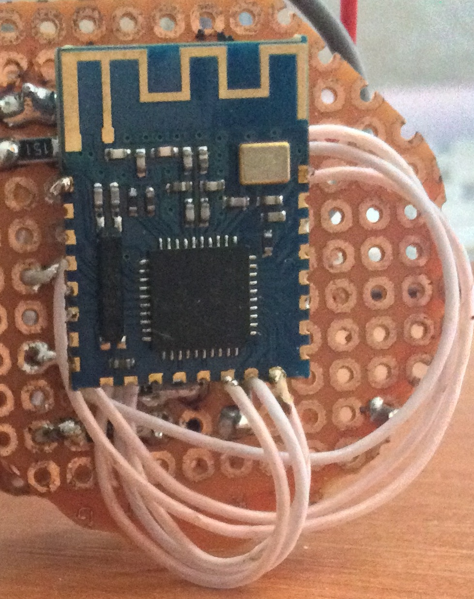

# lampyrid

(Project under development, comments are welcome)

Lampyrid is an intuitive mock app designed to give you full control over your Bluetooth (JDY-08) lamp. Easily connect your device using Bluetooth, choose from a wide range of colors, and instantly change the ambiance of your room. User can edit colors.
Developer can configure Bluetooth JDY-08 for working as lamp.
(Lampyrid any of several beetles of the family Lampyridae, comprising the fireflies.)

